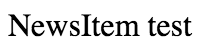
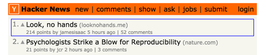
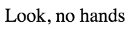
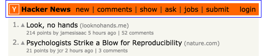
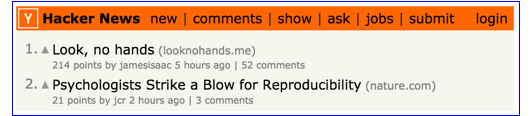

React HN
===
This tutorial will show you how to build [the Hacker News front page in React](https://mking.github.io/react-hn). We are going to build small, self-contained components, and then we will compose them (like Lego bricks) to get the final result.

Background required: HTML/CSS/JS

There are five parts to this tutorial:

 1. [Setup](#setup)

    

 2. Build the NewsItem

    

     1. [Display the title.](#newsitem-title)

        

     2. [Display the title and domain.](#newsitem-title-and-domain)

        

     3. [Display the subtext.](#newsitem-subtext)

        

     4. [Display the rank and vote.](#newsitem-rank-and-vote)

        

 3. [Build the NewsHeader](#newsheader)

    
 4. [Build the NewsList](#newslist)

    
 5. [Display live data](#hacker-news-api)

    During development, we use static data from the /json directory.

Setup
---
 1. Create the project directory structure.
    ```
    mkdir -p hn/{build/js,css,html,img,js,json}
    cd hn
    ```

 1. [Download the sample data](https://raw.githubusercontent.com/mking/react-hn/master/json/items.json) into /json.

 1. Download [y18.gif](https://news.ycombinator.com/y18.gif) and [grayarrow2x.gif](https://news.ycombinator.com/grayarrow2x.gif) into /img.

 1. Create an html page for testing the NewsItem component.
    ```
    <!DOCTYPE html>
    <html>
      <head>
        <meta charset="utf-8">
        <title>NewsItem</title>
        <link href="/css/NewsItem.css" rel="stylesheet">
      </head>
      <body>
        <div id="content"></div>
        <script src="/build/js/NewsItem.js"></script>
      </body>
    </html>
    ```

 1. Create an empty NewsItem component (/js/NewsItem.js). This is for testing our project setup.
    ```
    var $ = require('jquery');
    var React = require('react');

    var NewsItem = React.createClass({
      render: function () {
        return (
          <div className="newsItem">
            NewsItem test
          </div>
        );
      }
    });

    React.render(<NewsItem/>, $('#content')[0]);
    ```

 1. Create an empty NewsItem CSS file (/css/NewsItem.css).

 1. Create /package.json.
    ```
    {
      "name": "hn",
      "version": "0.1.0",
      "private": true,
      "browserify": {
        "transform": [
          ["reactify"]
        ]
      }
    }
    ```

 1. Install Browserify, React, and tools.
    ```
    # These dependencies are required for the running app.
    npm install --save react jquery lodash moment

    # These dependencies are required for building the app.
    npm install --save-dev browserify watchify reactify

    # These dependencies are globally installed command line tools.
    npm install -g browserify watchify
    ```

 1. Run Watchify. I normally run this in a separate terminal tab.
    ```
    watchify -v -o build/js/NewsItem.js js/NewsItem.js
    ```

 1. Test the project setup.
    ```
    # Visit http://localhost:8888/html/NewsItem.html
    python -m SimpleHTTPServer 8888
    ```

NewsItem Title
---
 1. Load data from the JSON file.
    ```
    var NewsItem = React.createClass({
      componentWillMount: function () {
        $.ajax({
          url: '/json/items.json'
        }).then(function (items) {
          // Log the data so we can inspect it in the developer console.
          console.log('items', items);
          this.setState({item: items[0]});
        }.bind(this));
      },

      getInitialState: function () {
        return {};
      },

      render: function () {
        // Render nothing if state is not yet loaded.
        if (!this.state.item) {
          return null;
        }

        return (
          <div className="newsItem">
            {this.state.item.title}
          </div>
        );
      }
    ```

    

 2. Refresh the browser to view your changes.

NewsItem Title and Domain
---
 1. Update the JS.
    ```
    var url = require('url');
    ...
    var NewsItem = React.createClass({
      ...
      getDomain: function () {
        return url.parse(this.state.item.url).hostname;
      },
      ...
      render: function () {
        ...
        return (
          <div className="newsItem">
            <a className="newsItem-titleLink" href={this.state.item.url}>{this.state.item.title}</a>
            <div className="newsItem-domain">
              ({this.getDomain()})
            </div>
          </div>
        );
      }
      ...
    ```

 2. Update the CSS. We are following [Jacob Thornton's CSS style guide](https://medium.com/@fat/mediums-css-is-actually-pretty-fucking-good-b8e2a6c78b06).
    ```
    body {
      font-family: Verdana, sans-serif;
    }

    .newsItem {
      color: #828282;
    }

    .newsItem-domain {
      font-size: 8pt;
      margin-left: 5px;
    }

    .newsItem-titleLink {
      color: black;
      font-size: 10pt;
      text-decoration: none;
    }
    ```

 3. Refresh the browser.

NewsItem Subtext
---
 1. Update the JS. We factor out the title part into its own method.
    ```
    var moment = require('moment');
    ...
    var NewsItem = React.createClass({
      ...
      getCommentLink: function () {
        var commentText = 'discuss';
        if (this.state.item.kids.length) {
          commentText = this.state.item.kids.length + ' comments';
        }

        return (
          <a href={'https://news.ycombinator.com/item?id=' + this.state.item.id}>{commentText}</a>
        );
      },
      ...
      getSubtext: function () {
        return (
          <div className="newsItem-subtext">
            {this.state.item.score} points by <a href={'https://news.ycombinator.com/user?id=' + this.state.item.by}>{this.state.item.by}</a> {moment.utc(this.state.item.time * 1000).fromNow()} | {this.getCommentLink()}
          </div>
        );
      },
      ...
      getTitle: function () {
        return (
          <div className="newsItem-title">
            ...
          </div>
        );
      },
      ...
      render: function () {
        ...
        return (
          <div className="newsItem">
            {this.getTitle()}
            {this.getSubtext()}
          </div>
        );
      }
    ```

 2. Update the CSS.
    ```
    .newsItem-subtext {
      font-size: 7pt;
    }

    .newsItem-subtext > a {
      color: #828282;
      text-decoration: none;
    }

    .newsItem-subtext > a:hover {
      text-decoration: underline;
    }
    ```

 3. Refresh the browser.

NewsItem Rank and Vote
---
 1. Update the JS. We use a fake rank for now.
     ```
    var NewsItem = React.createClass({
      ...
      getRank: function () {
        return (
          <div className="newsItem-rank">
            1.
          </div>
        );
      },
      ...
      getVote: function () {
        return (
          <div className="newsItem-vote">
            <a href={'https://news.ycombinator.com/vote?for=' + this.state.item.id + '&dir=up&whence=news'}>
              
            </a>
          </div>
        );
      },
      ...
      render: function () {
        ...
        return (
          <div className="newsItem">
            {this.getRank()}
            {this.getVote()}
            <div className="newsItem-itemText">
              {this.getTitle()}
              {this.getSubtext()}
            </div>
          </div>
        );
      }
    ```

 2. Update the CSS.
    ```
    .newsItem {
      ...
      align-items: baseline;
      display: flex;  
    }
    ...
    .newsItem-itemText {
      flex-grow: 1;
    }
    ...
    .newsItem-rank {
      flex-basis: 25px;
      font-size: 10pt;
      text-align: right;
    }
    ...
    .newsItem-vote {
      flex-basis: 15px;
      text-align: center;
    }
    ```

 3. Refresh the browser.

NewsHeader
---

NewsList
---

Hacker News API
---
